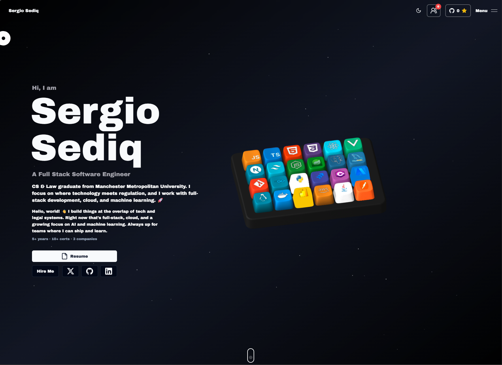
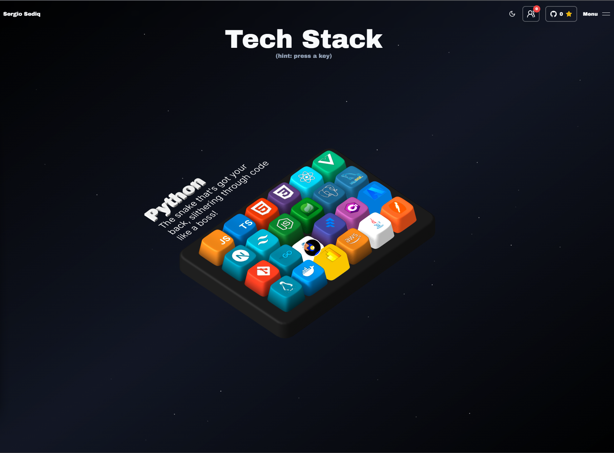
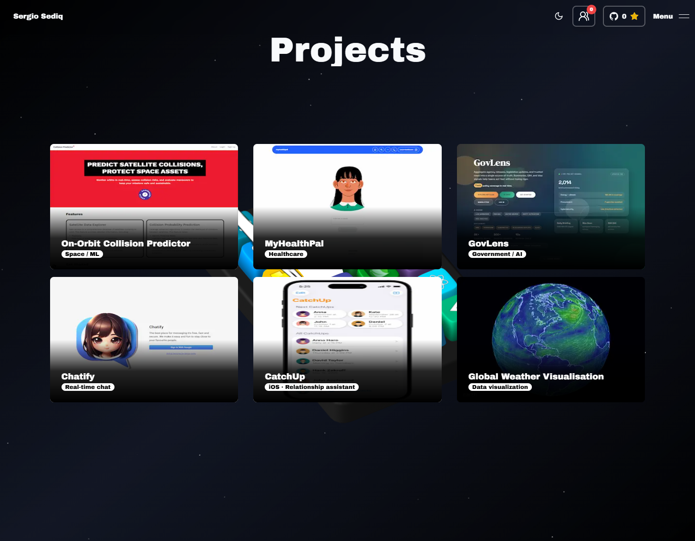
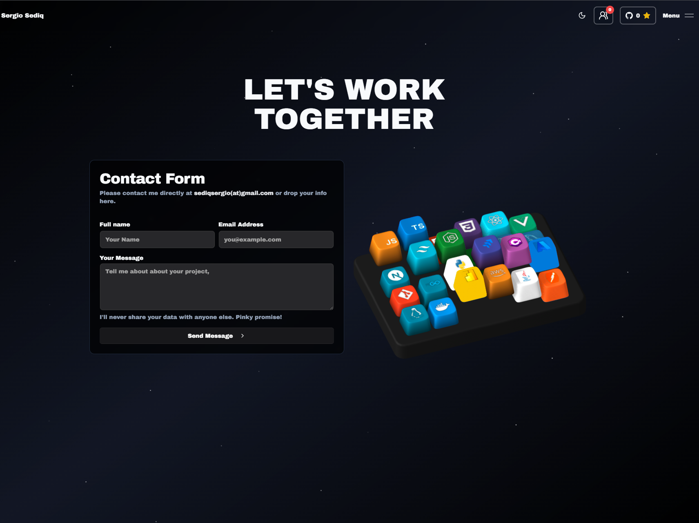

# 🚀 My Portfolio Website

Welcome to the repository for my personal portfolio website. This project is a creative playground where I showcase my **skills, projects, and design philosophy** through immersive 3D visuals, smooth animations, and modern web interactions.

The goal of this site is simple: **stand out visually while remaining performant, accessible, and responsive**.

---

## 🖼️ Preview

| **Landing** | **Skills** |
|:---:|:---:|
|  |  |
| **Projects** | **Contact** |
|  |  |

---

## ✨ Highlights

* 🎹 **3D Interactive Keyboard** — Custom-built with **Spline**, where each key represents a skill and reveals titles and descriptions on hover.
* 🎞️ **Fluid Animations** — Scroll, hover, and reveal animations powered by **GSAP** and **Framer Motion**.
* 🌌 **Space-Inspired Theme** — Particle effects on a dark canvas to simulate a cosmic environment.
* 📱 **Fully Responsive** — Optimized for desktop, tablet, and mobile devices.
* 🎨 **Creative + Functional** — Experimental visuals balanced with usability and performance.

---

## 🛠️ Tech Stack

### Frontend

* **Next.js**
* **React**
* **Tailwind CSS**
* **shadcn/ui**
* **Aceternity UI**

### Animations & 3D

* **GSAP**
* **Framer Motion**
* **Spline Runtime**

### Utilities & Services

* **Resend** (emails)
* **Socket.IO** (real-time features)
* **Zod** (schema validation)

---

## 🚀 Getting Started

### Prerequisites

* **Node.js** v14 or higher
* **npm** or **yarn**

### Installation

Clone the repository:

```bash
git clone https://github.com/SergioSediq/sergio-portfolio.git
```

Navigate to the project directory:

```bash
cd sergio-portfolio
```

Install dependencies:

```bash
npm install
# or
yarn install
```

Start the development server:

```bash
npm run dev
# or
yarn dev
```

Open **[http://localhost:3000](http://localhost:3000)** in your browser.

---

## 🌍 Deployment

The portfolio is deployed on **Vercel**.

To deploy your own version:

1. Push the project to a GitHub repository
2. Import the repository into Vercel
3. Vercel automatically builds and deploys the site

---

## 🤝 Contributing

Contributions, suggestions, and improvements are welcome.

* Open an **issue** for bugs or ideas
* Submit a **pull request** for enhancements

---

## 📄 License

This project is open source and licensed under the **MIT License**.
